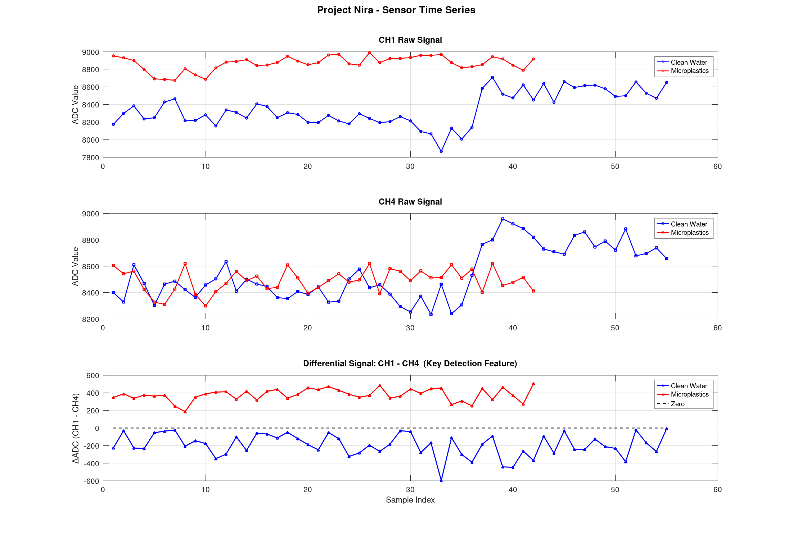
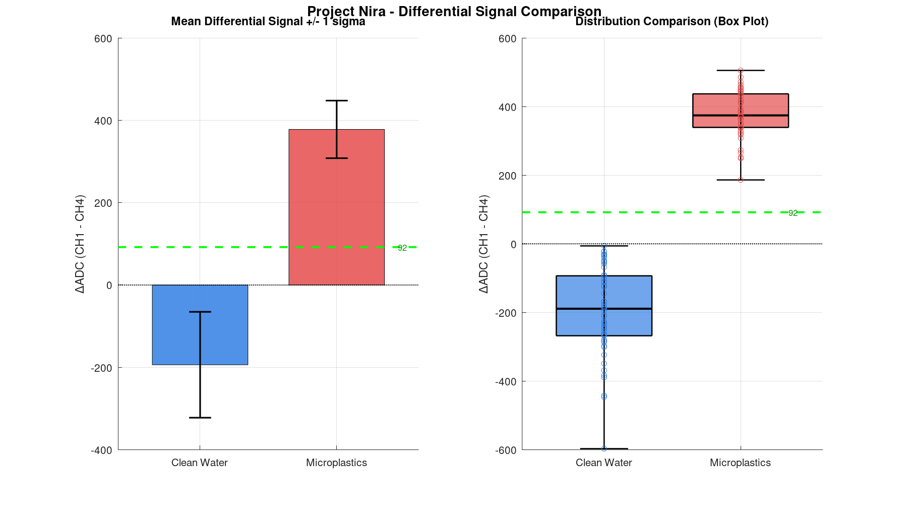
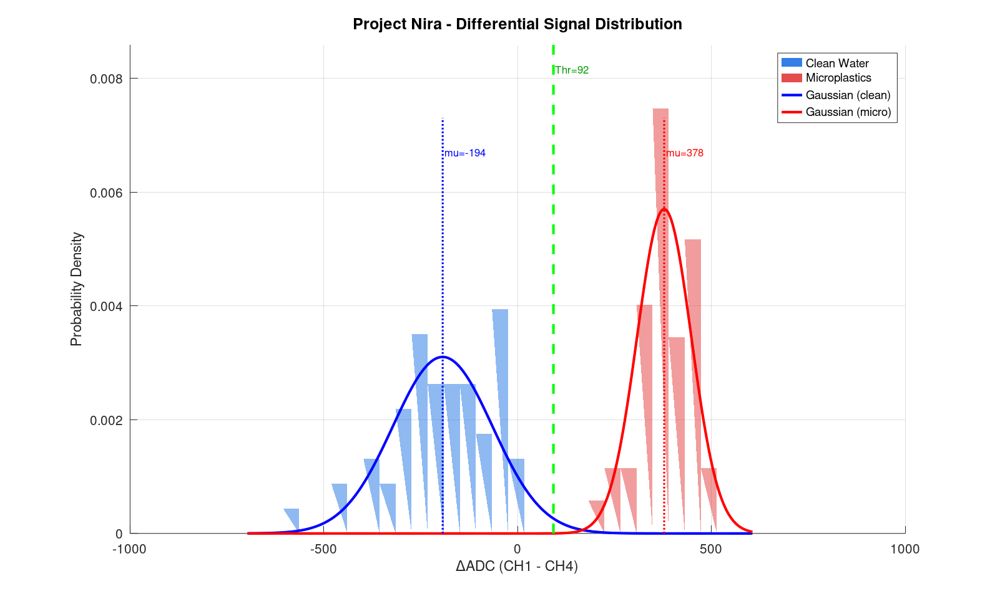
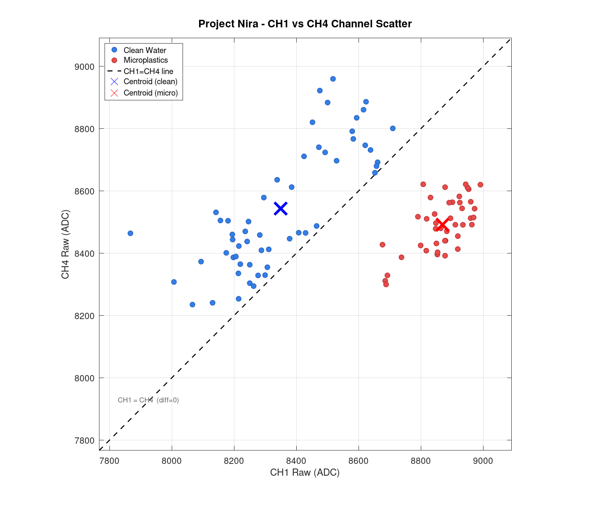

<!--
  Project Nira — Open Hardware Microplastics Detector
  SPDX-License-Identifier: CERN-OHL-P-2.0
  https://github.com/only-foss/Project-Nira
-->

<div align="center">

# Project Nira

### Open Hardware Microplastics Detector

[](https://cern-ohl.web.cern.ch/)
[](https://www.gnu.org/licenses/gpl-3.0)
[](https://creativecommons.org/licenses/by-sa/4.0/)
[](https://www.oshwa.org/definition/)
[]()
[](https://octave.org/)

**Affordable (₹2,500) · Portable · Field-deployable · Fully open-source**

*Detect microplastics in water without a ₹10L spectrometer.*

[Quick Start](#quick-start) · [Hardware](#hardware) · [Firmware](#firmware) · [Test Results](#test-results) · [Analysis](#analysis) · [Contributing](#contributing) · [License](#license)

</div>

---

## What is Project Nira?

Project Nira is an **open hardware initiative** to build an affordable, portable sensor that detects microplastics in water in real time using **capacitance-based differential sensing**.

The v1.0 prototype uses an **ESP32** microcontroller and a **ProtoCentral FDC1004** capacitance-to-digital converter to measure the dielectric difference between clean water and microplastic-contaminated water. Test results show a statistically significant signal shift of **+571 ADC units** (p = 3.24×10⁻⁴⁵) between the two conditions.

### Why This Matters

Microplastics (< 5 mm) are now found in rivers, lakes, groundwater, and drinking water worldwide. Conventional detection requires expensive spectroscopy equipment, lab preparation, and trained specialists — making regular monitoring impossible for rural schools, community water systems, and citizen scientists. **Project Nira aims to close that gap.**

---

## Key Specs — v1.0

| Parameter | Value |
|-----------|-------|
| Target cost | ₹2,500 (~USD 30) |
| Microcontroller | ESP32 DevKit v1 |
| Sensing IC | ProtoCentral FDC1004 Breakout v3 |
| Interface | I2C (GPIO 21 SDA, GPIO 22 SCL) |
| Detection method | Capacitance differential (CH1 − CH4) |
| Data logging | InfluxDB over WiFi |
| Detection threshold | diff_c1_c4 > 92 ADC units |
| Clean water mean diff | −193.6 ADC |
| Microplastic mean diff | +377.8 ADC |
| Signal shift | +571 ADC (4.4σ above clean baseline) |
| p-value (Welch t-test) | 3.24×10⁻⁴⁵ |
| Hardware license | CERN-OHL-P v2 |
| Firmware license | GPL v3 |
| Status | v1.0 breadboard — validated ✅ |

---

## Repository Structure

```
Project-Nira/
├── assets/                          # Photos, dashboard screenshots, circuit diagram
├── docs/
│   ├── OVERVIEW.md                  # Project overview
│   ├── USAGE.md                     # Usage instructions
│   └── Project-Nira_Open_Micro-plastic_Sensing.pdf
├── firmware/
│   └── v1.0_esp32_fdc1004
│       └── Project-Nira
│           ├── platformio.ini
│           └── src
│               └── main.cpp         # PlatformIO code  
├── hardware/
│   └── v1.0_esp32_sensor/
│       ├── Schematics.pdf
│       └── Nira_Micro-Plastic_Detection_Sensor/
│           ├── *.kicad_sch          # Schematic source
│           ├── *.kicad_pcb          # PCB source
│           └── *.kicad_pro          # Project file
├── tests/
│   ├── analysis/                    # GNU Octave scripts
│   │   ├── nira_analysis.m          # ← Run this
│   │   ├── nira_plot_timeseries.m
│   │   ├── nira_plot_comparison.m
│   │   ├── nira_plot_histogram.m
│   │   ├── nira_plot_scatter.m
│   │   ├── clean_water.csv
│   │   └── micro_water.csv
│   ├── data/
│   │   ├── test-0_cleanWater.csv    # Raw InfluxDB export — clean water
│   │   └── test-1_water_with_microplastics.csv  # Raw — microplastics
│   ├── results/                     # Auto-generated PNG plots
│   │   ├── nira_01_timeseries.png
│   │   ├── nira_02_comparison.png
│   │   ├── nira_03_histogram.png
│   │   └── nira_04_scatter.png
│   └── README_analysis.md
├── CITATION.cff
├── CHANGELOG.md
├── CONTRIBUTING.md
├── LICENSE.md                       # CERN-OHL-P v2
└── README.md                        # This file
```

---

## Hardware

### Components

| Component | Part | Purpose |
|-----------|------|---------|
| Microcontroller | ESP32 DevKit v1 (38-pin) | WiFi + data logging + I2C master |
| Sensing IC | ProtoCentral FDC1004 Breakout v3 | 4-channel capacitance-to-digital |
| Electrodes | 2× copper plates | Sensing elements in water |
| Passive | 4.7kΩ pull-up resistors × 2 | I2C line conditioning |

### Wiring

| FDC1004 Pin | ESP32 Pin | Colour | Notes |
|-------------|-----------|--------|-------|
| VCC | 3.3V | Red | Do NOT use 5V |
| GND | GND | Black | Common ground |
| SDA | GPIO 21 | Blue | I2C data |
| SCL | GPIO 22 | Yellow | I2C clock |
| CIN1 | — | Green | Electrode 1 (CH1) |
| CIN4 | — | Orange | Electrode 2 (CH4) |

> **Note:** CIN2 and CIN3 are unused in v1.0. FDC1004 I2C address is fixed at `0x50`.
> 4.7kΩ pull-up resistors on SDA and SCL are recommended if wire length exceeds 10 cm.

### KiCad Files

Schematic and PCB layout source files are in `hardware/v1.0_esp32_sensor/`. The v1.0 build is a breadboard prototype; a PCB is planned for v1.1.

---

## Firmware

### Requirements

- Arduino IDE 2.x or PlatformIO
- ESP32 board support: [espressif/arduino-esp32](https://github.com/espressif/arduino-esp32)
- Library: [ProtoCentral FDC1004](https://github.com/protocentral/ProtoCentral_fdc1004_breakout)
- InfluxDB Arduino library

### Flash

```bash
# 1. Open in Arduino IDE:
firmware/v1.0_esp32_fdc1004/src/nira_esp32.ino

# 2. Edit credentials in the sketch:
#    WIFI_SSID, WIFI_PASSWORD, INFLUXDB_URL, INFLUXDB_TOKEN, INFLUXDB_ORG, INFLUXDB_BUCKET

# 3. Select board: ESP32 Dev Module
# 4. Upload
```

### What it does

The firmware samples FDC1004 channels CH1 and CH4 at 10-second intervals, computes the differential signal (`diff_c1_c4 = CH1 − CH4`), and logs all three values to InfluxDB over WiFi under measurement `nira_sensor`, tagged with `device=nira_esp32`.

---

## Test Results

### Setup

- **Date:** 2026-03-22
- **Device:** `nira_esp32` (v1.0 breadboard)
- **Test 0:** Clean tap water — 55 samples
- **Test 1:** Water with microplastics added — 42 samples
- **Interval:** 10 seconds per sample
- **Analysis:** GNU Octave (see `tests/analysis/`)

### Statistics

| Metric | Clean Water (n=55) | Microplastics (n=42) |
|--------|--------------------|----------------------|
| CH1 mean (ADC) | 8349.2 | 8868.9 |
| CH4 mean (ADC) | 8542.9 | 8491.1 |
| **diff_c1_c4 mean** | **−193.6** | **+377.8** |
| diff_c1_c4 std | 128.6 | 69.9 |
| diff_c1_c4 min | −596.8 | +186.2 |
| diff_c1_c4 max | −6.0 | +505.2 |

**Welch t-test:** t = −27.99, df = 86.8, **p = 3.24×10⁻⁴⁵**

Detection threshold: `diff_c1_c4 > 92 ADC units` → microplastics present.

### Plots

<div align="center">

<br/>
<b>Plot 01 — Time Series</b><br/>
<sub>CH1 and CH4 raw ADC signals over time for both conditions.<br/>
The differential signal (CH1 − CH4) in the bottom panel is the key detection feature —<br/>
clean water stays negative, microplastics shift strongly positive.</sub>

<br/><br/>

<br/>
<b>Plot 02 — Differential Signal Comparison</b><br/>
<sub>Mean ± 1σ bar chart (left) and box plot (right).<br/>
Clean water mean: −193.6 ADC. Microplastic mean: +377.8 ADC.<br/>
Green dashed line = detection threshold (92 ADC units).</sub>

<br/><br/>

<br/>
<b>Plot 03 — Signal Distribution</b><br/>
<sub>Overlapping probability-density histograms with Gaussian fits.<br/>
The two distributions are fully separated with no overlap —<br/>
confirming the sensor reliably distinguishes both conditions.</sub>

<br/><br/>

<br/>
<b>Plot 04 — CH1 vs CH4 Scatter</b><br/>
<sub>Each point is one sample reading.<br/>
Clean water sits below the diagonal (CH4 > CH1).<br/>
Microplastics shift above the diagonal (CH1 > CH4). Centroids marked with ×.</sub>

</div>

> Plots generated by GNU Octave — run `octave nira_analysis.m` to reproduce.

> Plots generated by GNU Octave scripts in [`tests/analysis/`](tests/analysis/).
> Run `octave nira_analysis.m` to reproduce.

## Analysis

### Requirements

- [GNU Octave](https://octave.org/) ≥ 7.x (no extra packages — base Octave only)

```bash
# Install on Debian/Ubuntu
sudo apt install octave

# Install on Fedora
sudo dnf install octave
```

### Run

```bash
cd tests/analysis/
octave nira_analysis.m
```

Outputs a statistics report to console and saves 4 PNG plots to `tests/results/`.

### Export data from InfluxDB

```python
# python/nira_reader.py — see python/ folder
python nira_reader.py --start -1h --label test-2_sample
```

---

## Quick Start

```
1. Wire ESP32 + FDC1004 as per the wiring table above
2. Flash firmware/v1.0_esp32_fdc1004/src/nira_esp32.ino
3. Submerge electrodes in water sample
4. Monitor InfluxDB / Grafana dashboard
5. diff_c1_c4 > 92 → microplastics detected
```

---

## Contributing

Contributions are welcome. Please read [CONTRIBUTING.md](CONTRIBUTING.md) before submitting a pull request. Areas of active need:

- PCB design (v1.1)
- IP67 enclosure CAD
- Signal processing improvements
- Field validation with real water samples
- Translations (Hindi, Marathi, Tamil)

---

## License

| Component | License |
|-----------|---------|
| Hardware (KiCad files, schematics) | [CERN-OHL-P v2](https://cern-ohl.web.cern.ch/) |
| Firmware (Arduino sketch) | [GPL v3](https://www.gnu.org/licenses/gpl-3.0) |
| Analysis scripts (GNU Octave) | [GPL v3](https://www.gnu.org/licenses/gpl-3.0) |
| Documentation | [CC BY-SA 4.0](https://creativecommons.org/licenses/by-sa/4.0/) |

See [LICENSE.md](LICENSE.md) for full terms.

---

## Citation

If you use Project Nira in your research or work, please cite it using the metadata in [CITATION.cff](CITATION.cff), or:

```
only-foss. (2026). Project Nira: Open Hardware Microplastics Detector (v1.0).
GitHub. https://github.com/only-foss/Project-Nira
```

---

<div align="center">
<sub>Built with ❤️ for communities that deserve clean water monitoring — by only-foss</sub>
</div>
