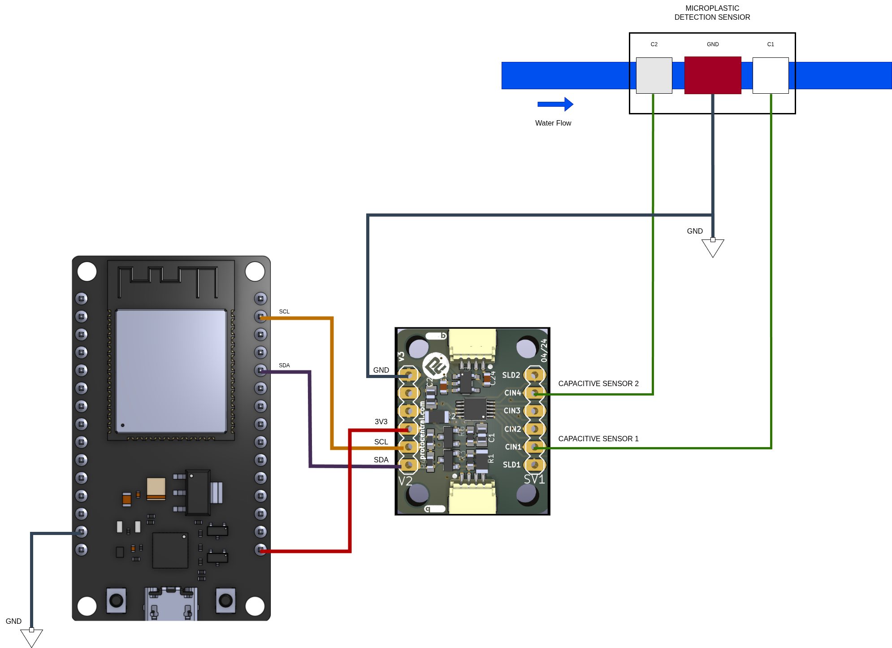

# Project Nira — Breadboard Wiring Guide

This document provides detailed instructions for wiring the v1.5 breadboard prototype of the Project Nira microplastics detector.

## Components Required
1. **ESP32 DevKit v1** (30 or 38-pin version)
2. **ProtoCentral FDC1004 Breakout v3** (Capacitance-to-Digital Converter)
3. **Electrodes:** Two parallel copper plates.
4. **Resistors:** 2x 4.7kΩ (I2C Pull-up resistors)
5. **Breadboard & Jumper Wires**

## Connection Table

| FDC1004 Pin | ESP32 Pin | Wire Color (Recommended) | Notes |
|-------------|-----------|--------------------------|-------|
| **VCC**     | 3.3V      | Red                      | Power. **DO NOT use 5V** (FDC1004 max rating is 3.6V). |
| **GND**     | GND       | Black                    | Common ground. |
| **SDA**     | GPIO 21   | Blue                     | I2C Data line. Add a 4.7kΩ pull-up resistor to 3.3V. |
| **SCL**     | GPIO 22   | Yellow                   | I2C Clock line. Add a 4.7kΩ pull-up resistor to 3.3V. |
| **CIN1**    | —         | Green                    | Connect directly to Electrode 1 (CH1). |
| **CIN4**    | —         | Orange                   | Connect directly to Electrode 2 (CH4). |

## Important Field Notes
* **Pull-up Resistors:** The I2C protocol requires pull-up resistors on the SDA and SCL lines. Since the FDC1004 breakout board might not include them (or they might be too weak for longer wires), adding external 4.7kΩ pull-ups between the I2C lines and 3.3V is **highly recommended** to prevent signal loss or communication errors.
* **I2C Address:** The FDC1004 has a fixed I2C address of `0x50`. Ensure no other components use this address.
* **Unused Pins:** The `CIN2` and `CIN3` pins on the FDC1004 are left unconnected for the differential setup in v1.5.

## Sensor Probe Setup
The sensor utilizes a differential capacitance technique. To achieve this:
1. Cut out two identical copper plates as electrodes.
2. Space them uniformly so water flows smoothly between them.
3. Keep the wires connecting the copper plates to `CIN1` and `CIN4` as short and symmetrical as possible to minimize parasitic capacitance.
